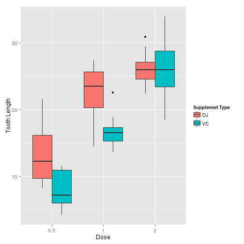

Tooth Growth Analysis
========================================================
author: Frederico Caram
date: 02-28-2016

Problem
========================================================

What is the Effect of Vitamin C on Tooth Growth in Guinea Pigs?
- Does the supplement type has any influence?
- How each supplement dosages impacts in the final result?

Exploratory Analysis
========================================================

 

Statistical Analysis
========================================================


Confidence Interval for the same dosage level between different supplements
- Dose 0.5 VC VS OG:

```
[1] -8.780943 -1.719057
```
- Dose 1.0 VC VS OG:

```
[1] -9.057852 -2.802148
```
- Dose 2.0 VC VS OG:

```
[1] -3.63807  3.79807
```

Conclusion
========================================================

When considering dose levels AND supplement types, OJ creates longer teeth than VC at dose levels of 0.5 mg and 1.0 mg, but at dose levels of 2.0 mg, there is no significant difference in teeth length between the two supplement types.
