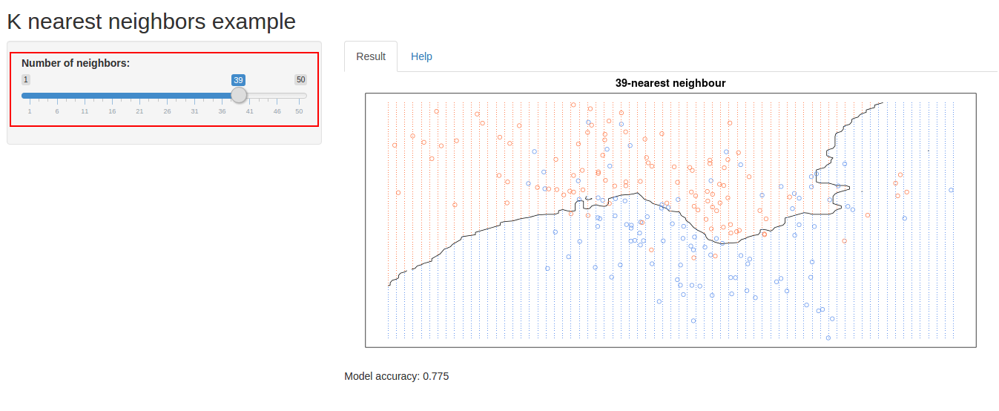

K Nearest Neighbors example
========================================================
author: Frederico Caram
date: 03-31-2016

Project
========================================================

This project is part of the Coursera Data Products Course Assignment. In order to show the understanding of using shiny to build a web application, and using RPresentation to explain
the application.

The application is hosted in the follwing address: https://fredcaram.shinyapps.io/knearest_neighbors_example/

Nearest Neighbor Function
========================================================
This application is an example of how different k's in the k-Nearest Neighbour Classification affects the results. 

For the example the "class" package was used:

This package has various functions for classification, including k-nearest
neighbour, Learning Vector Quantization and Self-Organizing Maps.

More details can be found at the package site: https://cran.r-project.org/web/packages/class/index.html

The used function was the "knn"(k-Nearest Neighbour Classification) function

The dataset
========================================================

For the example we used the ElemStatLearn package mixture.example dataset, the package documentation can be found at:
https://cran.r-project.org/web/packages/ElemStatLearn/index.html

The dataset is just a simulated mixture example with 200 instances and two classes. 100 members in each class.

Using the application
========================================================

Drag the slide bar to test different value of k for the nearest neighbors model, as shown in the following picture:

Example adapted from the book Elements of Statistical Learning:
http://statweb.stanford.edu/~tibs/ElemStatLearn/

